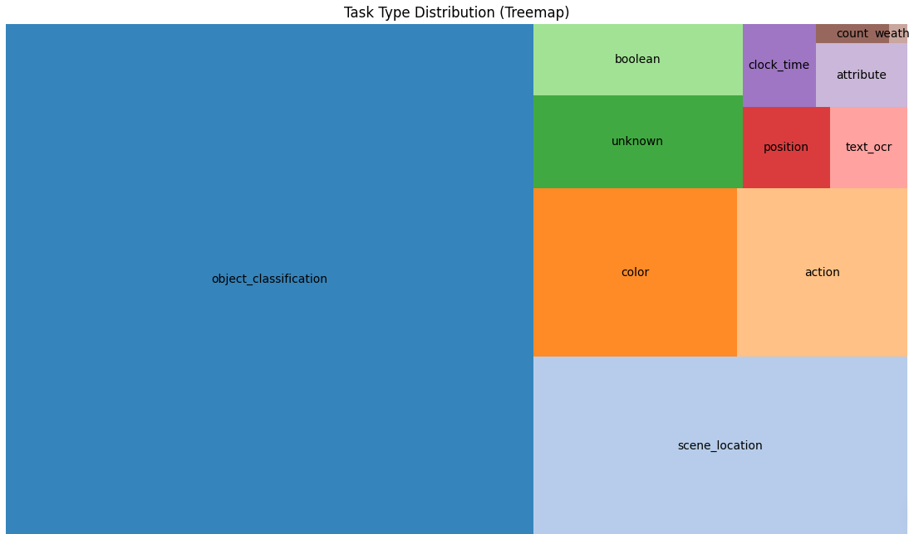
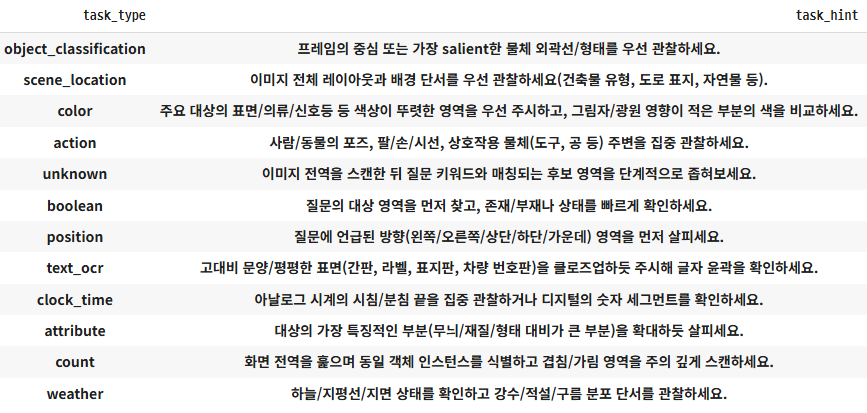
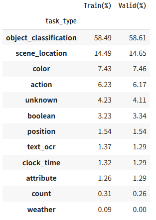

# Task Type
이미지를 주고 프롬프트와 선지와 함께 질문을 날려 원하는 선지의 답을 얻는 VQA 모델에서 당연히 **프롬프트도 중요한 input**이다.
```python
SYSTEM_INSTRUCT = (
    "당신은 시각 정보를 세밀하게 분석하여 질문에 논리적으로 답하는 비주얼 AI 전문가입니다. "
    "이미지에서 주요 대상과 그 특징(형태, 재질, 위치, 배경)을 관찰하고, "
    "보기 중 가장 가능성이 높은 정답을 선택하세요. "
    "최종 출력은 반드시 a, b, c, d 중 하나의 소문자 한 글자만 작성하세요."
)

def build_mc_prompt(question, a, b, c, d):
    base_prompt = (
        f"질문: {question}\n\n"
        f"보기:\n(a) {a}\n(b) {b}\n(c) {c}\n(d) {d}\n\n"
        "이미지를 관찰한 후, 가장 알맞은 보기를 고르세요. "
        "정답은 반드시 소문자 알파벳 a, b, c, d 중 하나로만 답하세요."
    )
    return base_prompt
```
때문에 프롬프에 **질문 유형마다 적절한 힌트**를 제공하면 원하는 답을 조금더 정확히 얻어낼 수 있지 않을까? 생각이 들었다.
## Task Type 분류
유형은 `question`과 각 `4개의 선지`를 기준으로 **하드코딩**하여 구분했다.

주의할 점은 `train`데이터만을 기준으로 해야한다는 것이다!
(데이터 누수 주의)

### 분류 결과



## 활용 1) Prompt Engineering: task hint
구분한 테스크 별로 질문에 넣어줄 힌트를 생성했다.


그리고 이 힌트를
```python
SYSTEM_INSTRUCT = (
    "당신은 시각 정보를 세밀하게 분석하여 질문에 논리적으로 답하는 비주얼 AI 전문가입니다. "
    "이미지에서 주요 대상과 그 특징(형태, 재질, 위치, 배경)을 관찰하고, "
    "보기 중 가장 가능성이 높은 정답을 선택하세요. "
    "최종 출력은 반드시 a, b, c, d 중 하나의 소문자 한 글자만 작성하세요."
)

def build_mc_prompt(question, a, b, c, d, task_hint):
    base_prompt = (
        f"질문: {question}\n\n"
        f"보기:\n(a) {a}\n(b) {b}\n(c) {c}\n(d) {d}\n\n"
        "이미지를 관찰한 후, 가장 알맞은 보기를 고르세요. "
        "정답은 반드시 소문자 알파벳 a, b, c, d 중 하나로만 답하세요."
    )
    base_prompt += f"\n\n힌트: {task_hint}"
    return base_prompt
```

프롬프트에 적용해주었다.

## 활용 2) Validation Strategy

대회 환경상 제한된 컴퓨팅 자원과 짧은 기간 때문에
일반적인 K-Fold Cross Validation과 같은 대규모 앙상블 전략을 적용하기 어려웠다.
따라서 단일 모델의 일반화 성능을 최대한 확보하고자 validation 전략을 고민하게 되었다.

### validation strategy 목적

Train–Valid 간 성능 격차를 통해 모델의 강건성(Generalization) 평가

`Validation 점수`를 **모델 선택 기준**으로 사용할 수 있도록 구성

데이터 분포 편향을 최소화하여 **안정적인 학습** 검증 환경 구축

### 데이터 분석 결과
- Label(a/b/c/d) 분포
    - 네 가지 보기(Label)가 거의 균등하게 분포되어 있음\
→ Label 기준으로는 큰 클래스 불균형 이슈가 없음 

- Task Type 분포
    - 질문 유형(Task Type)별 데이터 편차가 매우 큼
→ 특정 유형이 한쪽에 쏠릴 위험 존재 ❌
→ 검증 결과가 편향될 가능성 있음

### Split 전략

Validation Set은 `Task Type`을 기준으로 `Stratified Sampling 적용`

Train/Validation 데이터 모두에서
`다양한 질문 유형이 균형 있게 포함`되도록 설계

Label은 이미 균등하므로 Task Type을 우선적으로 고려



### 이렇게 하면:

| 개선 효과          | 설명                       |
| -------------- | ------------------------ |
| 일반화 성능 판단 ↑    | 특정 유형에 오버피팅되는 모델 방지      |
| Valid 결과 신뢰도 ↑ | 다양한 문제 유형에 대한 성능 반영      |
| 모델 안정성 ↑       | 실 배포/테스트 데이터 성격과 동일하게 구성 |


## 결론
질문 유형을 나눠서 프롬프팅한 결과 public 기준 accuracy 0.006 상승(약 12개 더 맞춤) 하였다.

VQA 테스크에서 "모델에게 어떤 프롬프트를 던져주냐도 원하는 목적을 달성하는데 중요한 포인트중 하나다"라는 것을 알 수 있었다. 

또한 Test 환경과 동일한 분포를 가정한 Validation 구성으로
실제 테스트에서의 안정적인 성능을 기대할 수 있었다.

추가적으로 Hard Task 집중 학습이나 Task difficulty 기반 평가로 확장도 고려할 수 있겠다는 생각이 들었다. 